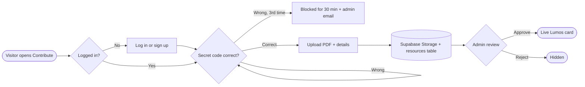
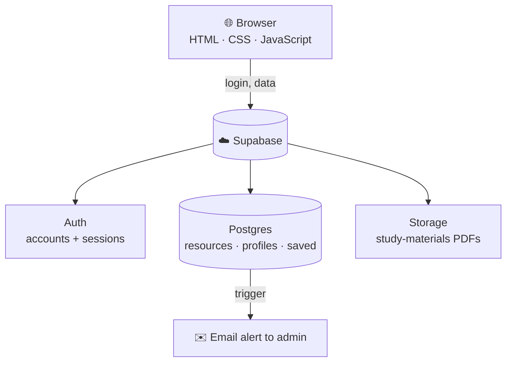

<div align="center">



### 📚 A study-material sharing portal, built by students for students

<p>
  
  
  
  
</p>

<a href="https://percyjacksonn.github.io/lumos-/"><b>🌐 Open Lumos</b></a>
&nbsp;•&nbsp;
<a href="#-contribute-to-lumos"><b>⬆️ How to contribute</b></a>
&nbsp;•&nbsp;
<a href="#-set-up-your-own-lumos"><b>🛠️ Run your own</b></a>

</div>

<br>

> _"Finding your study material shouldn't become a study session itself."_ 😭

Notes, question papers and lab manuals end up scattered across WhatsApp groups, Google Classroom and random drives.
**Lumos puts them in one organised place**, sorted by **department → year → semester → subject**.

<div align="center">

`🔎 FIND` &nbsp;➜&nbsp; `🧭 BROWSE` &nbsp;➜&nbsp; `📄 PREVIEW` &nbsp;➜&nbsp; `❤️ SAVE` &nbsp;➜&nbsp; `🎓 STUDY`

</div>

---

## ✨ What you can do

| | |
|---|---|
| 🧭 **Browse by path** | Pick your department, year, semester and subject. Every level is one tap. |
| 🗂️ **Seven categories** | Notes · Previous Year Papers · Important Questions · Assignments · Lab Materials · Syllabus · Reference |
| 🔢 **Unit-wise notes** | Notes, Important Questions and Assignments are grouped by **Unit 1-8**. Lab materials simply say *Lab Materials*. |
| 🔎 **Smart search** | Type `DBMS` and find *Database Management Systems*. Search works on names, course codes and initials. |
| 📄 **Preview in the browser** | Open the PDF right on the page, or download it. |
| ❤️ **Save for later** | Heart any resource. Your saved notes and download history follow your account. |
| 👤 **Real accounts** | Sign up with email and password, or log in with a 6-digit email code. Pick an avatar and a display name. You stay signed in on refresh. |
| ⬆️ **Contribution portal** | Authorised contributors upload PDFs. The admin reviews them before they go live. |

---

## ⬆️ Contribute to Lumos

<div align="center">

</div>

**Only the Lumos admin and people who have the secret code can contribute.** Anyone can open the Contribute page and read how it works. Uploading needs a login and the code.



---

## 🔒 How it is kept safe

| Area | What protects it |
|---|---|
| **Secret code** | Stored only as a bcrypt hash in a table the browser can't read. Never in the repo. |
| **Who can approve or delete** | Enforced by Supabase **Row Level Security**, not by hiding buttons. A normal user calling the API directly is refused. |
| **Uploads** | Only into your own folder, **PDF only**, **25 MB max**, no overwriting existing files. |
| **Pending files** | Not listed and not downloadable through the site until the admin approves them. |
| **Passwords** | Handled entirely by Supabase Auth. Lumos never stores them. |
| **Emails** | Sent from the database with a key kept in Supabase. No code or password is ever emailed. |

---

## 🛠️ Tech stack

<div align="center">

<br><br>


</div>



No framework and no build step: plain HTML, CSS and JavaScript talking to Supabase, hosted free on GitHub Pages.

---


---

## 📁 Project files

```
lumos-/
├── index.html        the page shell
├── style.css         the whole look: doodle cards, colours, animations
├── script.js         browsing, search, login, profile, saved, downloads
├── contribute.js     the contribution portal + admin review page
└── images/           screenshots used in this README
```

---

## 🛠️ Set up your own Lumos

<details>
<summary><b>Click to open the steps</b> (about 20 minutes, all free)</summary>

<br>

1. **Clone it**
   ```bash
   git clone https://github.com/percyjacksonn/lumos-.git
   cd lumos-
   ```
2. **Create a free project** at [supabase.com](https://supabase.com). Under *Project Settings → API* copy the project URL and the public (publishable) key.
3. **Paste them into `script.js`** at the top (`supabaseUrl` and `supabaseKey`). Never paste a `service_role` key into the website.
4. **Create a bucket** called `study-materials` in *Storage* and set it to **Public**.
5. **Run the database setup** in *SQL Editor → Create a new snippet*, one file per snippet and in order: the base setup (profiles, saved, downloads), then the contribution setup, then your secrets file (access code, your admin email, email key).
6. **Turn on email alerts (optional)** with a free [Resend](https://resend.com) key.
7. **Open `index.html`** with VS Code Live Server, or publish the repo with *Settings → Pages*.

> 🔑 Keep the file that holds your access code and email key **out of GitHub**.

</details>

---

## 🍴 Fork & improve

Want to experiment? Fork the repo and build on top of it. Found a bug or have an idea? Open an issue or send a pull request. Pull requests and kind suggestions are always welcome. 💛

---


<div align="center">

**Made with 💛**

<sub>⭐ If Lumos helped you study, give it a star.</sub>

</div>


